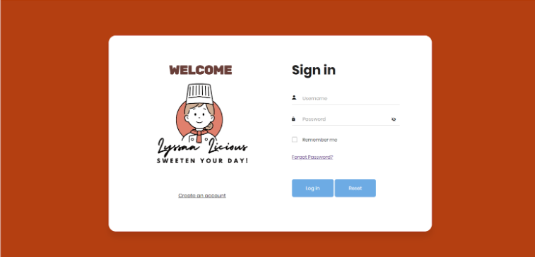
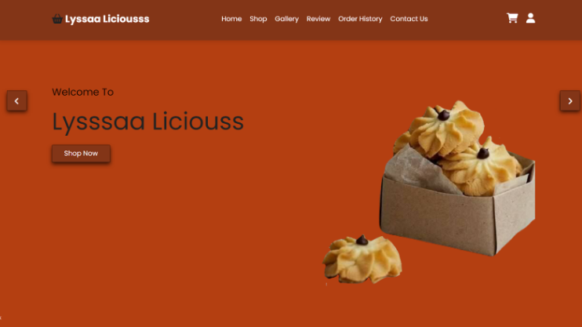
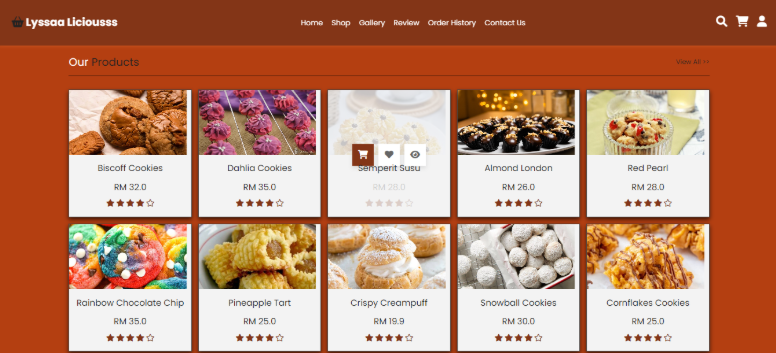
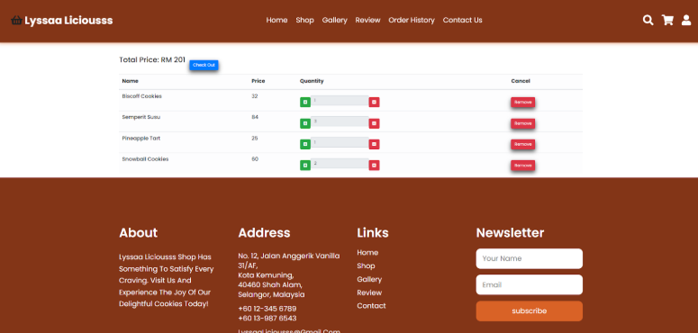
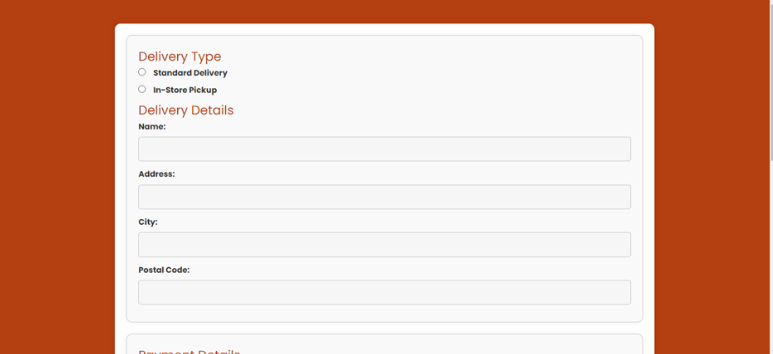
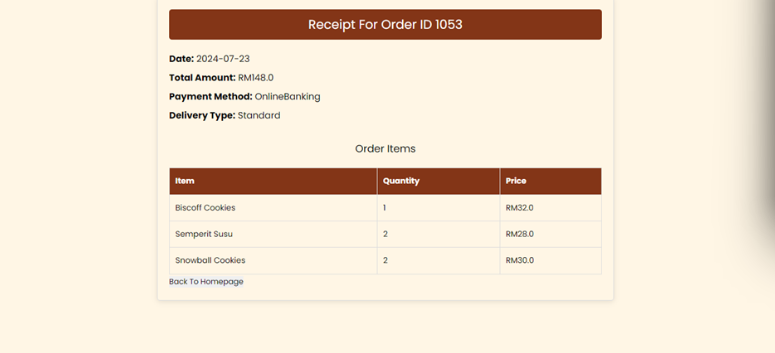
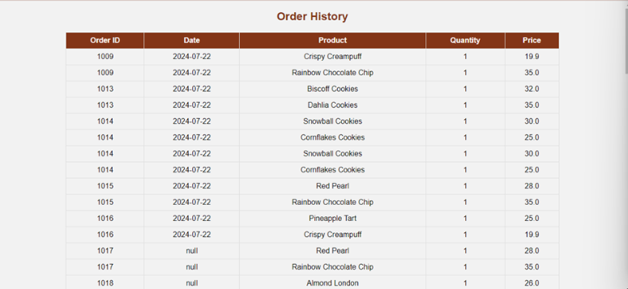
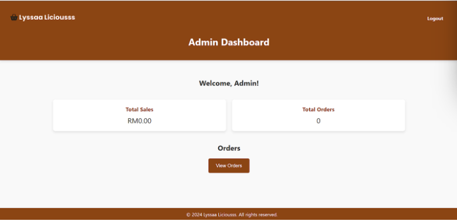
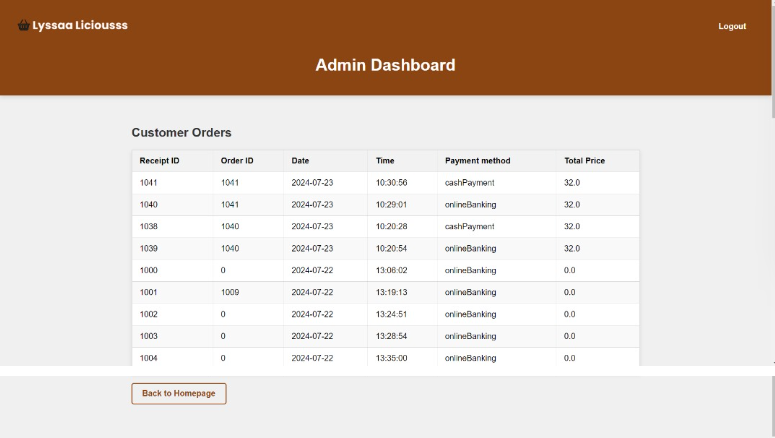

# LyssaaLiciousss — Pastry Ordering Web Application (Java EE MVC)

A web-based ordering system built for **Lyssaa Liciousss** to replace manual WhatsApp-based order handling with a centralized platform for **customer ordering, payment/checkout flow, and admin order management**.

## Why this project matters
Online micro-businesses (especially student-run) often manage orders manually via chat, which is time-consuming and difficult to track. This system streamlines the workflow by allowing customers to place orders without direct messaging, while giving the business owner a single place to monitor orders end-to-end.

## Key Features
### Customer
- User registration & login
- Browse products (shop page)
- Add to cart & manage cart items
- Checkout flow (delivery + payment step)
- Receipt generation
- Order history tracking

### Admin
- Admin dashboard
- View/manage customer orders (order list + details)

## Tech Stack
- **Backend:** Java (Servlet/JSP)
- **Architecture:** MVC (Model–View–Controller) + DAO pattern
- **Frontend:** HTML/CSS/JavaScript (JSP views)
- **Database:** MySQL (SQL scripts included)

## UI Preview (Selected Screens)
Below are the core screens that represent the main end-to-end user flow and admin functionality.

<table>
  <tr>
    <td align="center">
      <b>Login</b> 
      
    </td>
    <td align="center">
      <b>Customer Homepage</b> 
      
    </td>
    <td align="center">
      <b>Shop</b> 
      
    </td>
  </tr>

  <tr>
    <td align="center">
      <b>Cart</b> 
      
    </td>
    <td align="center">
      <b>Checkout (Delivery & Payment)</b> 
      
    </td>
    <td align="center">
      <b>Receipt</b> 
      
    </td>
  </tr>

  <tr>
    <td align="center">
      <b>Order History</b> 
      
    </td>
    <td align="center">
      <b>Admin Dashboard</b> 
      
    </td>
    <td align="center">
      <b>Admin: View Orders</b> 
      
    </td>
  </tr>
</table>

## Project Structure
- `src/` — Java source code (Servlets, controllers, DAO, models)
- `webapp/` — JSP pages + static assets (CSS/JS/images)
- `database/` — SQL scripts to create/populate tables
- `screenshots/` — UI screenshots used in this README

## Setup (Local)
### 1) Database
1. Create a MySQL database (example: `lyssaa_liciousss`)
2. Run the SQL scripts in `database/` (create tables + sample data if provided)

### 2) Configure DB Connection
Update your database credentials in the DB connection class (commonly `DBConnection.java` or similar in the source folder):
- Host
- Port
- Database name
- Username
- Password

### 3) Run the Web App
- Import the project into an IDE that supports Java EE (e.g., IntelliJ IDEA / Eclipse)
- Configure a server (Tomcat)
- Deploy and run

## Notes
- Credentials, environment configs, and DB connection settings may vary depending on your local setup.
- Extra screens (OTP / reset password flow) are available under `screenshots/extra/` but are not shown here to keep the README focused on the main product flow.
